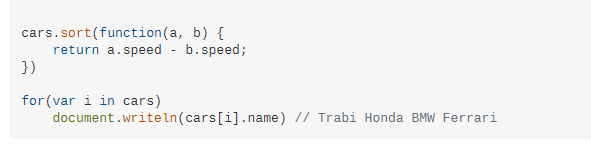

Crea una aplicación que almacene información sobre los planetas del sistema solar: 
Distancias al Sol.
Tamaños relativos (cuantas veces son el tamaño de la Tierra).
Fechas de descubrimiento.

Debes utilizar arrays para almacenar la información de cada planeta.

Crea objetos Planeta a partir de estos arrays y muestra la información en la consola.

- [x] Trabaja con, al menos, la información de 5 planetas.
- [x] La implementación del constructor Planeta ha de proporcionar a sus objetos las propiedades y/o métodos adecuados.
- [x] Los objetos Planeta se han de crear a partir de los arrays utilizando un bucle.
- [x] Crea una función para mostrar la información de un planeta en la consola.
- [x] Se debe utilizar la clase Date() para trabajar con las fechas.
- [x] Muestra la información de todos los planetas en la consola.
- [x] Utiliza un método de arrays para ordenar los planetas por distancia al Sol de menor a mayor y muestra la información ordenada en la consola.

